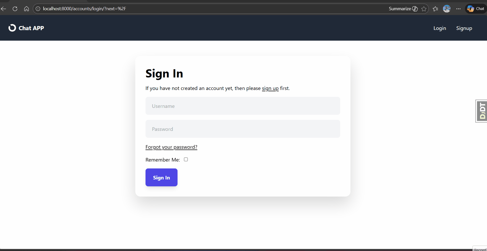

# Django Chat Application

This is a real-time chat application built with Django, Django Channels, and Redis. It supports private and group chats, user authentication, and file sharing.



## Features

-   Real-time private and group messaging
-   User authentication (signup, login)
-   File sharing in chatrooms
-   Creation and management of group chatrooms
-   WebSocket communication for live updates

## Technologies Used

-   **Backend:** Django, Django REST Framework, Django Channels
-   **Real-time:** Redis, Daphne
-   **Authentication:** Djoser, Django Allauth, Simple JWT
-   **Database:** PostgreSQL
-   **Other:** Celery (for background tasks), Whitenoise (for static files), drf-yasg (for API documentation), htmx

## Setup and Installation

To get this project up and running on your local machine, follow these steps:

1.  **Clone the repository:**
    ```bash
    git clone https://github.com/Ahmed3atef/Chat-App.git
    cd Chat-App
    ```

2.  **Set up Python environment and install dependencies:**
    This project uses `uv` for dependency management.
    ```bash
    uv venv
    uv sync
    ```

3.  **Environment Variables:**
    Create a `.env` file in the root directory and configure your database and Django secret key:
    ```
    DJANGO_KEY=your_secret_key
    DB_NAME=your_db_name
    DB_USER=your_db_user
    DB_PASSWORD=your_db_password
    DB_HOST=localhost
    DB_PORT=5432
    ```

4.  **Database Setup:**
    Ensure PostgreSQL and Redis servers are running. You can use Docker for this:
    ```bash
    python manage.py startdockerservers
    ```
    Run database migrations:
    ```bash
    python manage.py migrate
    ```

5.  **Create a Superuser (for admin access):**
    ```bash
    python manage.py createsuperuser
    ```

## Usage

To start the application and its associated services:

1.  **Start Gunicorn server:**
    ```bash
    python manage.py start_gunicorn_server
    ```
2.  **Start Celery worker:**
    ```bash
    python manage.py start_celery_worker
    ```
3.  **Start Celery beat (for scheduled tasks):**
    ```bash
    python manage.py start_celery_beat
    ```
4.  **Access the application:**
    Open your web browser and navigate to `http://localhost:8000`.

## API Documentation

The API documentation can be accessed at `/swagger/` (Swagger UI) or `/redoc/` (ReDoc) after the server is running.
